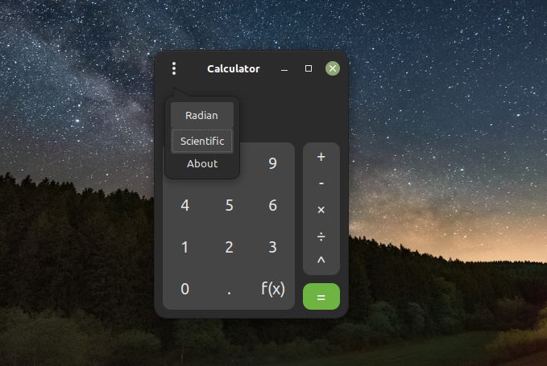
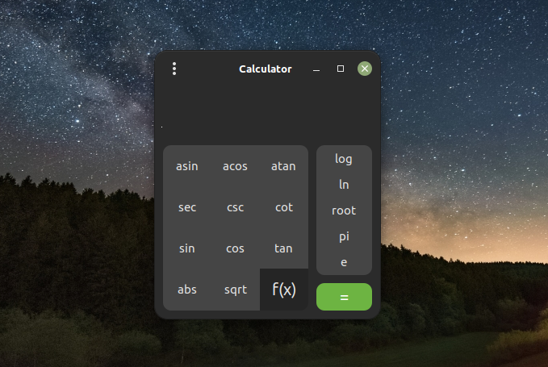
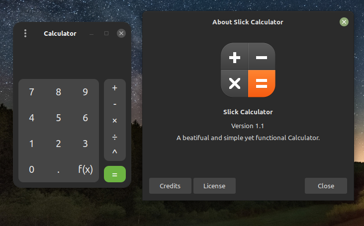
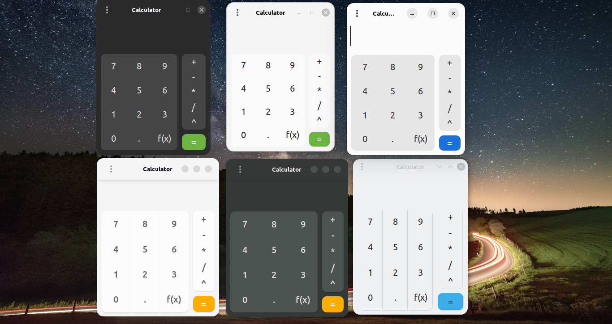

# Pretty Calculator


Pretty Calculator is a functional and beautiful calculator for Linux, built with Gtk3.
# Features
- Operators (+-×÷^)
- Functions (trigonometric, inverse trigonometric, logarithmic, and more)
- History (use up/down arrow keys to access history)
- Press Esc button to clear

# Planned Features
- Financial mode
# Build From Source
First install the required dependencies
- libgtkmm-3.0-dev
- libboost-dev
- g++

Then run the following commands:
```
git clone https://github.com/hamza-Algohary/pretty-calculator
make build      # Compile the source code
make build-pkgs # Build deb package and tarball package for easy installation.
```
After running make build-pkgs you will find the generated packages in packages/ folder

# Download

#### You can find binary packages in [releases](https://github.com/hamza-Algohary/pretty-calculator/releases)

### Note: To install the .tar.gz archive.
#### First you have to install package `libgtkmm-3.0-dev` and `libboost-dev`(Package names differ according to your package manager).
extract it and inside the extracted folder type the following:
```
chmod +x install.sh
sudo ./install.sh
```
To unistall,
```
chmod +x uninstall.sh
sudo ./uninstall.sh
```
# Screenshots




### Old Screenshot


