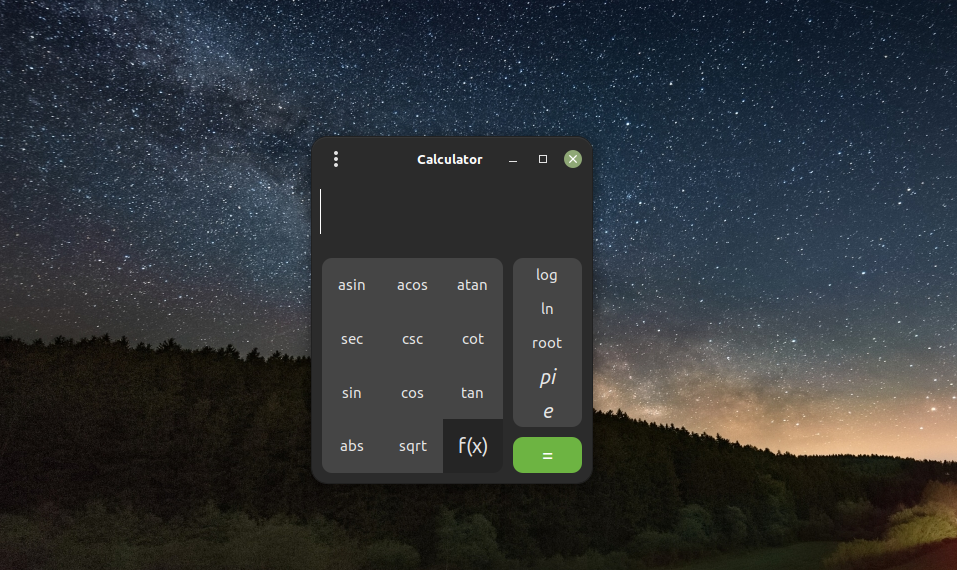
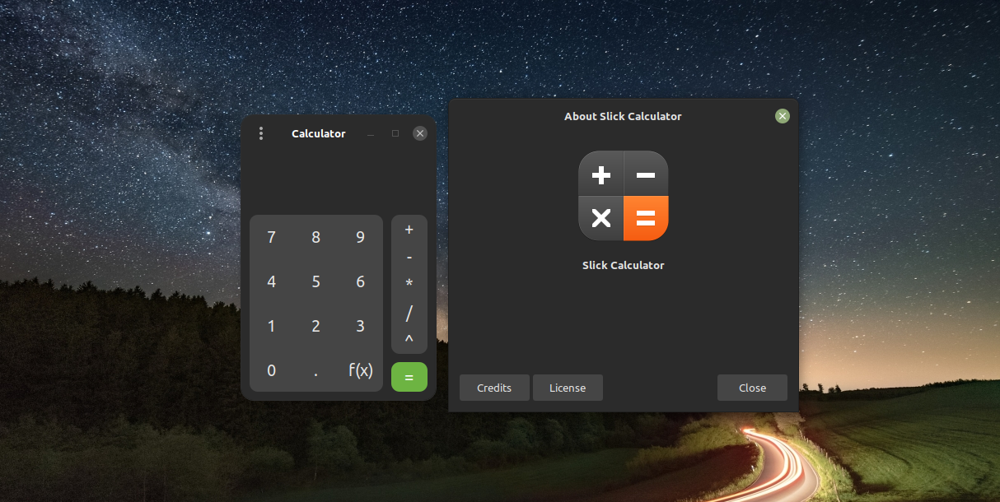

# Pretty Calculator


Pretty Calculator is functional and beautiful calculator for Linux, built with Gtk3.
# Build From Source
First install the required dependencies
- libgtkmm-3.0-dev
- g++

Then run the following commands:
```
git clone https://github.com/hamza-Algohary/pretty-calculator
cd pretty-calculator/src
make
./pretty-calculator
```

# Download
#### NOTE: You have to install package `libgtkmm-3.0-dev` before installing packages.
#### You can find binary packages in [releases](https://github.com/hamza-Algohary/pretty-calculator/releases/tag/v1.0)

### Another Note: To install the .tar.gz archive.
extract it and inside the extracted folder type the following:
```
chmod +x install.sh
sudo ./install.sh
```
To unistall,
```
chmod +x uninstall.sh
sudo ./uninstall.sh
```
# Screenshots





