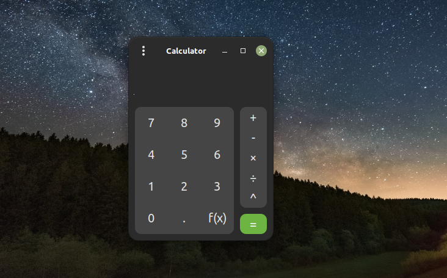

# Pretty Calculator


Pretty Calculator is functional and beautiful calculator for Linux, built with Gtk3.
# Build From Source
First install the required dependencies
- libgtkmm-3.0-dev
- g++

Then run the following commands:
```
git clone https://github.com/hamza-Algohary/pretty-calculator
cd pretty-calculator/src
make
./pretty-calculator
```

# Download
Install the above dependencies first, then download and install one of the the following:
- [pretty-calculator.deb](https://github.com/hamza-Algohary/pretty-calculator/blob/main/pretty-calculator.deb)
- [pretty-calculator.tar.gz](https://github.com/hamza-Algohary/pretty-calculator/blob/main/pretty-calculator.tar.gz)

Note: To install the .tar.gz archive extract it and inside the extracted folder type the following:
```
chmod +x install.sh
sudo ./install.sh
```
To unistall,
```
chmod +x uninstall.sh
sudo ./uninstall.sh
```
